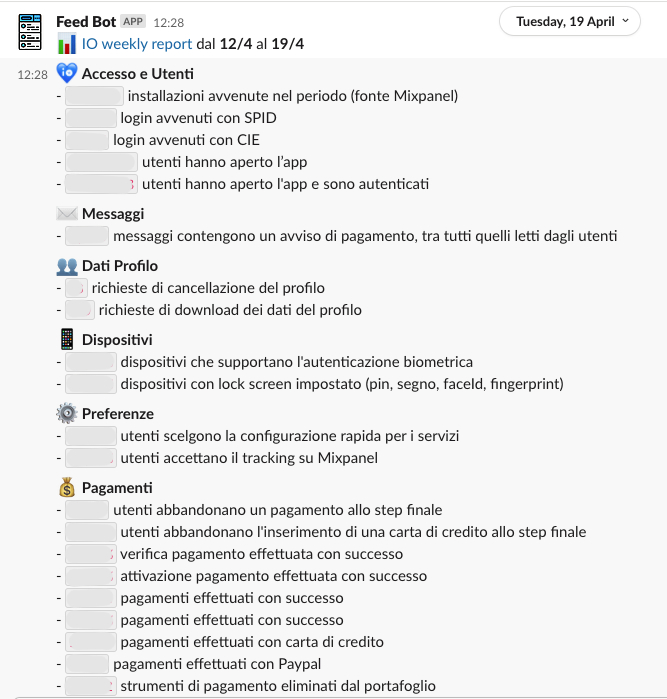

# description
This tool collects some data about the IO usage and [sends them to a Slack channel](https://pagopaspa.slack.com/archives/CQVJ1JES2/p1638780664485600) [every Monday at about 9.00am](.github/workflows/python-app.yml)


# setup
### mixpanel
To collect data from Mixpanel, it requires a [service token](https://eu.mixpanel.com/report/2460815/settings/#project/2460815/serviceaccounts)
<br/>It must be included as **env variable**
example:<br/>
`MIXPANEL_SERVICE_TOKEN`:`mp_service_token`

### slack
To send the reports to Slack, it requires the Slack web hook
<br/>It must be included as **env variable**
example:<br/>
`SLACK_WEB_HOOK`:`https://hooks.slack.com/services/xyz/zyx/123`

### how to add a report
- create you own report class by extending the base [Report](src/models/report.py)

```python
class FancyReport(Report):

	def load_report(self) -> Union[str, None]:
		return "42 - Answer to the Ultimate Question of Life, the Universe, and Everything"


life_section = SectionReports("✨ *Life Mystery*",
                                    [FancyReport("most important answer")])
```
then add the `life_section` to the [sections list](src/main.py)


### requirements
It needs a Python interpreter version >= 3.5

Install requirements
`pip install -r requirements.txt`

# run
`python main.py`